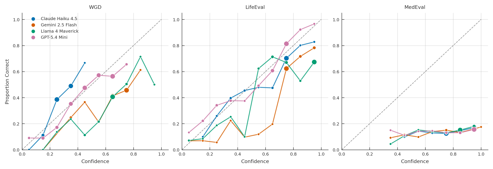
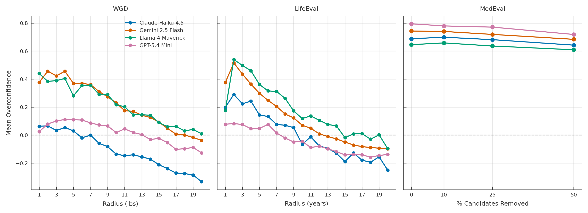
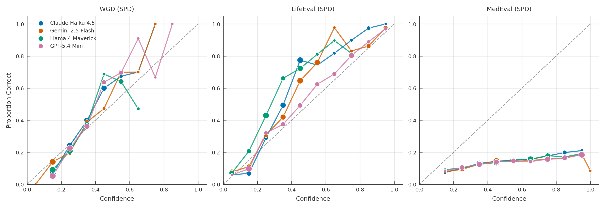
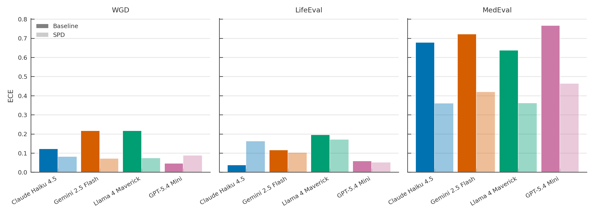
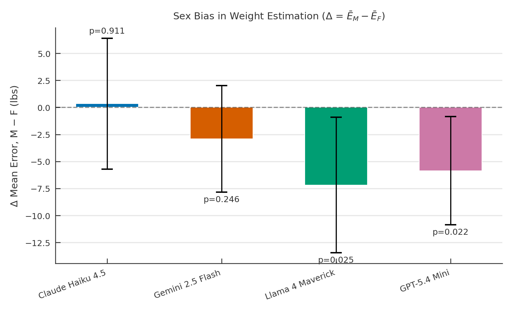
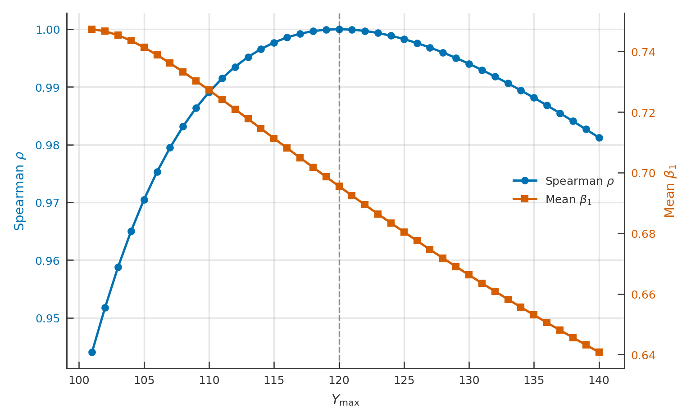

# BayesEval

A benchmark suite for evaluating LLM calibration on Bayesian inference tasks across diverse domains.

## Overview

BayesEval measures whether language models can produce well-calibrated probabilistic reasoning — whether a model's stated confidence actually tracks its true accuracy. Unlike standard benchmarks with binary correct/incorrect answers, BayesEval uses **continuous ground-truth probabilities** derived from real-world distributions, scored with **strictly proper scoring rules** (Brier Score).

Each domain in BayesEval presents a different class of Bayesian inference problem with known analytical ground truth, enabling precise measurement of calibration quality.

We evaluate four frontier LLMs — Claude Haiku 4.5, Gemini 2.5 Flash, Llama 4 Maverick, and GPT-5.4 Mini — via the OpenRouter API. Each domain is tested in two prompting modes: **Direct Confidence Elicitation (DCE)**, where the model reports a single point estimate and scalar confidence, and **Subjective Probability Distribution (SPD)**, where the model outputs a distribution over bins or candidates.

## Domains

| Domain | Description | Ground Truth Source |
|--------|-------------|-------------------|
| [WGD](domains/WGD/) | Weight estimation from photos | Deterministic: measured weight within tolerance |
| [LifeEval](domains/LifeEval/) | Actuarial mortality estimation | Gompertz conditional survival CDF |
| [MedEval](domains/MedEval/) | Differential-diagnosis calibration | DDXPlus synthetic patient differentials |

## Prompts

All prompts are sent as a single `user` message with no system message. For standard (non-SPD) question sets, a JSON format instruction is appended automatically by the runner. For SPD question sets, the format instruction is embedded in the `confidence_prompt`.

### WGD (Standard)

**question_prompt** (one per tolerance level, `within_lbs` ∈ 1–20):

> Look at this photo of a person. You MUST estimate their weight in pounds. Do not refuse or abstain — give your best guess even if uncertain. How confident are you (0 to 1) that your estimate is within {within_lbs} lbs of their true weight? If you are very unsure, use a low confidence score, but you must still provide a weight estimate.

**confidence_prompt:**

> Respond with ONLY valid JSON in this exact format: {"Answer": "\<weight in lbs\>", "Confidence": "0.XX"}

### WGD_SPD

**question_prompt:**

> Look at this photo of a person. You MUST estimate their weight in pounds. Do not refuse or abstain — give your best guess even if uncertain.

**confidence_prompt** (one per `bin_width` ∈ {2, 10, 20, 40}, with `top_n` ∈ {10, 10, 5, 3}):

> Using weight ranges of exactly {bw} lbs (e.g. [150, {150+bw})), report your top {top\_n} most likely ranges for this person's weight. Each range must be exactly {bw} lbs wide. You choose where to place them.
>
> Respond with ONLY a JSON array in this exact format:
> [{"min": \<low\_weight\>, "max": \<high\_weight\>, "confidence": \<probability between 0 and 1\>}, ...]

### LifeEval (Standard)

**question_prompt** (one per sex × age 0–100):

> Given that an American {male/female} has lived at least {age} years, estimate how old {he/she} will be when {he/she} dies.

**confidence_prompt** (one per `radius` ∈ 1–20):

> How certain are you that your answer is within {radius} year(s) of the true value?

### LifeEval_SPD

**question_prompt:** Same as standard LifeEval.

**confidence_prompt** (one per `bin_width` ∈ {2, 10, 20, 40}, with `top_n` ∈ {10, 10, 5, 3}):

> Using age ranges of exactly {bw} years (e.g. [70, {70+bw})), report your top {top\_n} most likely ranges where this person will die. Each range must be exactly {bw} years wide. You choose where to place them.
>
> Respond with ONLY a JSON array in this exact format:
> [{"min": \<start\_age\>, "max": \<end\_age\>, "confidence": \<probability between 0 and 1\>}, ...]

### MedEval (Standard)

**question_prompt:**

> You are a diagnostic reasoning assistant. Based on the patient vignette below, pick the single most likely pathology from the candidate list. You MUST commit to one diagnosis — do not hedge or list alternatives.
>
> {vignette}
>
> Candidate pathologies:
> {candidates}

Where `{vignette}` is a JSON object containing patient demographics and clinical findings, and `{candidates}` is a bullet list of possible diagnoses. Candidate-removal variants (0%, 10%, 25%, 50%) present fewer diagnostic options with renormalized probabilities.

**confidence_prompt:**

> There are {n\_candidates} candidate pathologies. Estimate the probability (0 to 1) that your chosen pathology is the correct diagnosis for this patient, given only the symptoms and candidates provided. A uniform prior would assign {uniform\_prior} to each candidate. Respond with ONLY valid JSON: {"Answer": "\<pathology\>", "Confidence": "0.XX"}

### MedEval_SPD

**question_prompt:**

> You are a diagnostic reasoning assistant. Based on the patient vignette below, estimate the probability that each candidate pathology is the correct diagnosis. You MUST assign a probability to every candidate.
>
> {vignette}
>
> Candidate pathologies:
> {candidates}

**confidence_prompt:**

> For each candidate pathology, report your estimated probability that it is the correct diagnosis. Probabilities should sum to 1.0.
>
> Respond with ONLY a JSON array in this exact format:
> [{"pathology": "\<name\>", "confidence": \<probability between 0 and 1\>}, ...]

## Scoring Framework

All domains share a common scoring framework based on strictly proper scoring rules:

- **Brier Score**: `BS = (confidence - true_probability)^2` — the primary metric
- **Murphy Decomposition**: `BS = Reliability - Resolution + Uncertainty`
  - **Reliability**: calibration quality (lower = better calibrated)
  - **Resolution**: sharpness of predictions (higher = more informative)
  - **Uncertainty**: intrinsic difficulty of the question

A perfectly calibrated model reports confidence `c` equal to the true probability `p` for each question, yielding `BS = 0`.

## Models

| Model | OpenRouter Slug |
|-------|-----------------|
| Claude Haiku 4.5 | `anthropic/claude-haiku-4.5` |
| Gemini 2.5 Flash | `google/gemini-2.5-flash` |
| Llama 4 Maverick | `meta-llama/llama-4-maverick` |
| GPT-5.4 Mini | `openai/gpt-5.4-mini` |

Model selection, concurrency, and run parameters are configured in `config.yaml`.

## Research Questions

Analysis lives in `analysis/analysis.ipynb`; auditable fact-checking in `analysis/fast_facts.ipynb`. Figures are saved to `analysis/figs/`.

### RQ 1: What is the nature of LLM calibration?

Combined calibration curves for all models across all three domains. Each subplot overlays all models on one axis; dot size reflects the number of samples in that confidence bin.



Summary of model calibration across all domains and prompting modes. Accuracy denotes mean correctness (WGD) or mean true probability (LifeEval, MedEval). Overconfidence = Mean Confidence − Accuracy. β₁ is the OLS slope of overconfidence on difficulty percentile (see RQ 2). ECE_SPD and ΔECE show the effect of SPD prompting (see RQ 3).

| Domain | Model | Accuracy | Mean Conf. | Overconf. | β₁ | ECE | ECE_SPD | ΔECE (%) |
|--------|-------|----------|------------|-----------|-----|-----|---------|----------|
| WGD | Claude Haiku 4.5 | 0.385 | 0.274 | −0.111 | +0.433\*\*\* | 0.123 | 0.081 | −34.0\* |
| WGD | Gemini 2.5 Flash | 0.421 | 0.638 | +0.217 | +0.556\*\*\* | 0.217 | 0.072 | −67.0\*\*\* |
| WGD | Llama 4 Maverick | 0.372 | 0.588 | +0.216 | +0.471\*\*\* | 0.216 | 0.074 | −66.0\*\*\* |
| WGD | GPT-5.4 Mini | 0.427 | 0.443 | +0.016 | +0.237\*\*\* | 0.046 | 0.087 | +89.0\*\*\* |
| LifeEval | Claude Haiku 4.5 | 0.632 | 0.660 | +0.029 | +0.734\*\*\* | 0.037 | 0.162 | +334.8\*\*\* |
| LifeEval | Gemini 2.5 Flash | 0.650 | 0.766 | +0.116 | +0.804\*\*\* | 0.116 | 0.103 | −11.6 |
| LifeEval | Llama 4 Maverick | 0.646 | 0.819 | +0.174 | +0.794\*\*\* | 0.196 | 0.171 | −12.9\*\* |
| LifeEval | GPT-5.4 Mini | 0.639 | 0.597 | −0.042 | +0.450\*\*\* | 0.059 | 0.052 | −11.9 |
| MedEval | Claude Haiku 4.5 | 0.145 | 0.823 | +0.678 | +0.120\*\*\* | 0.678 | 0.360 | −46.8\*\*\* |
| MedEval | Gemini 2.5 Flash | 0.148 | 0.870 | +0.722 | +0.130\*\*\* | 0.722 | 0.420 | −41.9\*\*\* |
| MedEval | Llama 4 Maverick | 0.148 | 0.786 | +0.637 | +0.115\*\*\* | 0.637 | 0.361 | −43.4\*\*\* |
| MedEval | GPT-5.4 Mini | 0.148 | 0.914 | +0.766 | +0.158\*\*\* | 0.766 | 0.463 | −39.5\*\*\* |

\*p<0.05, \*\*p<0.01, \*\*\*p<0.001

### RQ 2: What role does task difficulty play in model calibration?

Overconfidence (`Confidence - true_probability`) plotted against each domain's difficulty proxy:

| Domain | Difficulty Proxy | Range | Harder |
|--------|-----------------|-------|------------|
| WGD | `within_lbs` — weight tolerance | 1--20 lbs | Lower |
| LifeEval | `radius` — age window | 1--20 years | Lower |
| MedEval | `removal_pct` — candidates removed from differential | 0, 10, 25, 50% | Lower |



All 12 β₁ slopes are significantly positive (p < 0.001), indicating that overconfidence systematically increases with task difficulty across all models and domains.

### RQ 3: Does prompting models to output SPDs improve calibration?

SPD prompting asks models to output a probability distribution over bins (WGD, LifeEval) or candidates (MedEval) rather than a single point estimate and scalar confidence. The modal bin's or candidate's confidence is compared against the same ground truth used in DCE scoring.





SPD prompting significantly reduces ECE in 9 of 12 model–domain combinations. The effect is strongest in MedEval (39–47% reduction) and WGD (34–67% reduction for 3 of 4 models). Two cases show significant ECE *increases*: GPT-5.4 Mini on WGD (+89%) and Claude Haiku 4.5 on LifeEval (+335%). See the summary table above for all values and significance levels.

## Post-Hoc Analyses

### Sex Bias in WGD Weight Estimates

We examine whether models systematically over- or under-estimate weight differently for male vs. female subjects. Directional error (Answer − true\_weight) is computed per photo, then averaged by sex. Welch's t-test assesses the significance of the mean error difference (Male − Female) with 95% CIs.



### Sensitivity of LifeEval Difficulty Metric to Y\_max

The LifeEval difficulty metric depends on a maximum-age parameter Y\_max. We sweep Y\_max from 101 to 140 and measure rank-correlation (Spearman ρ) of difficulty percentiles against the reference (Y\_max = 120), alongside the mean overconfidence slope (β₁). Both metrics are stable across the range, confirming the difficulty ranking is robust to the Y\_max choice.



## Project Structure

```
BayesEval/
├── README.md
├── CLAUDE.md
├── eval.py                    # Config-driven evaluation runner
├── config.yaml                # Run configuration (domains, models, concurrency)
├── requirements.txt
├── src/
│   ├── runner/
│   │   ├── executor.py        # Async task runner (DCE + SPD modes)
│   │   ├── openrouter_client.py
│   │   └── dashboard.py       # Live rich progress dashboard
│   └── features/
│       └── estimate_costs.py  # Pre-run cost estimator
├── analysis/
│   ├── scoring.py             # Unified scoring (Brier, Murphy, Gompertz CDF)
│   ├── analysis.ipynb         # Main analysis notebook (RQ1–3, post-hoc)
│   ├── fast_facts.ipynb       # Auditable fact-checking for paper
│   ├── evaluate_diff.py
│   ├── sensitivity_ymax.py
│   ├── rq1_summary_table.txt  # LaTeX summary table
│   └── figs/                  # All generated figures
├── domains/
│   ├── WGD/                   # Weight Guessing Dataset
│   ├── LifeEval/              # Actuarial mortality estimation
│   └── MedEval/               # Differential diagnosis
├── docs/                      # Pipeline documentation per domain
├── results/                   # Raw model outputs (git-ignored)
└── thoughts/                  # Research notes and experiment logs
```

## Getting Started

```bash
pip install -r requirements.txt
export OPENROUTER_API_KEY=...
```

## Running Evaluations

All runs are driven by `config.yaml` — edit it instead of passing flags:

```bash
python eval.py --config config.yaml
```

The config selects `domains` (list of folder names under `domains/`, or `all`),
`models` (OpenRouter slugs), `mode` (`batch` async or `seq`), and `concurrency`.
A live `rich` dashboard tracks progress per `(domain, model)` task. Raw
responses land in `results/<domain>/<model>.csv`; a combined `results/summary.csv`
is written at the end. SPD domains are configured with `spd: true` and a separate
`benchmark_spd.csv`.

Scoring for all domains is in `analysis/scoring.py`. To add a new domain,
add a scorer function there and register it in `_SCORERS`, then create
`domains/<name>/Data/benchmark.csv`.

## Related Work

This project is part of an honors thesis on LLM calibration. See individual domain READMEs for domain-specific methodology and results.
